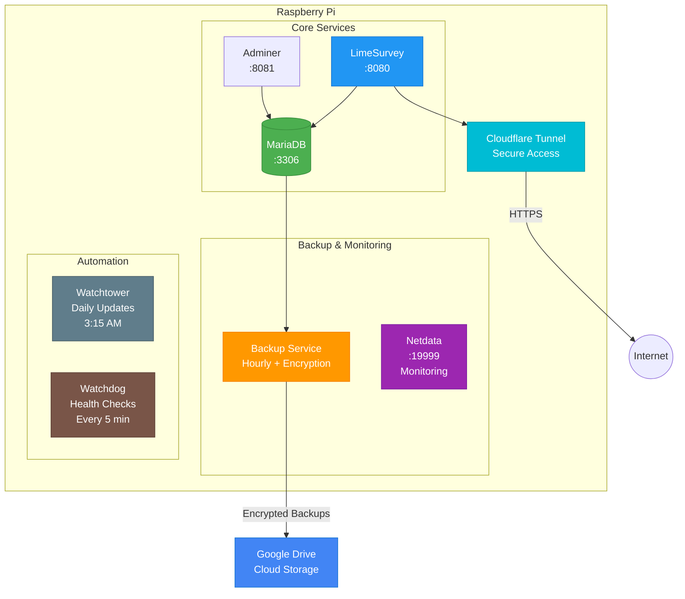

# LimeSurvey on Raspberry Pi with Auto-Backup & Monitoring

[](https://github.com/etiennechabert/limesurvey-pi-stack/actions/workflows/ci.yml)
[](https://github.com/etiennechabert/limesurvey-pi-stack/actions/workflows/security.yml)
[](https://opensource.org/licenses/MIT)
[](https://www.docker.com/)
[](https://www.raspberrypi.org/)

Docker setup for running LimeSurvey on Raspberry Pi with automated backups to Google Drive, Cloudflare Tunnel access, and monitoring.

## Features

**Core:**
- LimeSurvey survey platform
- MariaDB database with Adminer interface
- Cloudflare Tunnel (no port forwarding required)

**Backups:**
- Hourly automated backups to Google Drive
- AES-256 encryption
- Intelligent rotation (grandfather-father-son)
- Optional restore-on-boot (stateless mode)

**Monitoring & Updates:**
- Netdata monitoring (system, containers, HTTP)
- Watchtower automatic updates
- Watchdog auto-recovery on failures

**DevOps:**
- GitHub Actions CI/CD
- Automated security scanning
- Systemd auto-start

## 📚 Documentation

### Essential Reading (Start Here)
1. **[QUICKSTART.md](QUICKSTART.md)** - 30-minute setup guide
2. **[BACKUP_GUIDE.md](BACKUP_GUIDE.md)** - Backup configuration, encryption, restore
3. **[RESTORE_ON_BOOT.md](RESTORE_ON_BOOT.md)** - Stateless Pi mode

### Security & Operations
4. **[SECURITY.md](SECURITY.md)** - Security best practices, encryption, compliance
5. **[CONTRIBUTING.md](CONTRIBUTING.md)** - CI/CD, testing, contributions

### For Survey Users
6. **[FOR_SURVEY_USERS.md](FOR_SURVEY_USERS.md)** - Non-technical guide for survey participants

### Reference
- **[LICENSE](LICENSE)** - MIT License
- **[.env.example](.env.example)** - Environment variables template

## Table of Contents
- [Features](#features)
- [Documentation](#-documentation)
- [Architecture](#architecture)
- [Getting Started](#getting-started)
- [Quick Reference](#quick-reference)
- [File Structure](#file-structure)
- [License](#license)

## Architecture



## Getting Started

### Prerequisites
- Raspberry Pi (3B+, 4, or 5)
- At least 2GB RAM
- Raspberry Pi OS (64-bit)
- Docker and Docker Compose

### Installation

**Complete setup guide:** See **[QUICKSTART.md](QUICKSTART.md)** for detailed 30-minute setup instructions.

**Quick overview:**
1. Install Docker on Raspberry Pi
2. Clone this repository
3. Configure Google Drive API (service account)
4. Set up Cloudflare Tunnel
5. Configure environment variables (`.env`)
6. Start services: `docker compose up -d`
7. Enable auto-start on boot

### Access Ports

| Service | Local URL | Notes |
|---------|-----------|-------|
| LimeSurvey | `http://<pi-ip>:8080` | Survey platform |
| Adminer | `http://<pi-ip>:8081` | Database admin |
| Netdata | `http://<pi-ip>:19999` | Monitoring dashboard |
| Public | `https://your-domain.com` | Via Cloudflare Tunnel |

## Quick Reference

### Common Commands

```bash
# Start all services
docker compose up -d

# Stop all services
docker compose down

# View logs
docker compose logs -f

# Restart specific service
docker compose restart limesurvey

# Check running containers
docker compose ps

# Update containers
docker compose pull && docker compose up -d

# Manual backup
docker compose exec db_backup python /app/backup.py

# Enable auto-start
sudo systemctl enable limesurvey.service

# Check service status
sudo systemctl status limesurvey.service
```

### Troubleshooting

**Container won't start:**
```bash
docker compose logs <container-name>
```

**Backup failing:**
```bash
docker compose logs db_backup
ls -la google-credentials.json
```

**Can't access services:**
```bash
# Check if ports are listening
sudo netstat -tlnp | grep -E '8080|8081|19999'

# Find Pi IP
hostname -I
```

**More troubleshooting:** See [QUICKSTART.md](QUICKSTART.md#troubleshooting)

## File Structure

```
limesurvey-pi-stack/
├── docker-compose.yml              # Docker Compose configuration
├── .env.example                    # Environment template
├── google-credentials.json         # Google API key (not in repo)
│
├── README.md                       # This file
├── QUICKSTART.md                   # Setup guide
├── BACKUP_GUIDE.md                 # Backup documentation
├── RESTORE_ON_BOOT.md              # Stateless mode
├── SECURITY.md                     # Security guide
├── CONTRIBUTING.md                 # CI/CD documentation
├── FOR_SURVEY_USERS.md             # User-facing guide
│
├── limesurvey.service              # Systemd auto-start
├── limesurvey-watchdog.service     # Watchdog service
├── limesurvey-watchdog.timer       # Watchdog timer
│
├── .github/workflows/              # GitHub Actions
│   ├── ci.yml                      # CI pipeline
│   └── security.yml                # Security scanning
│
├── backup-service/                 # Backup Docker image
│   ├── Dockerfile
│   ├── backup.py                   # Backup script
│   ├── entrypoint.sh
│   └── requirements.txt
│
├── scripts/                        # Utility scripts
│   ├── restore-db.sh
│   ├── restore-on-boot.sh
│   ├── pre-commit-check.sh
│   └── watchdog/
│       └── health-monitor.sh
│
├── monitoring/netdata/             # Netdata configuration
│   ├── health.d/                   # Custom alerts
│   └── go.d/                       # Custom collectors
│
└── backups/                        # Local backup storage (auto-created)
```

## License

MIT License - see [LICENSE](LICENSE) file.

**Third-party software used:**
- LimeSurvey: GPL v2+
- MariaDB: GPL v2
- Adminer: Apache 2.0 / GPL v2
- Netdata: GPL v3
- Watchtower: Apache 2.0

**Note:** MIT License applies to this repository's configuration and scripts only.

## Support

- **Setup issues:** Check [QUICKSTART.md](QUICKSTART.md) troubleshooting section
- **Backup issues:** See [BACKUP_GUIDE.md](BACKUP_GUIDE.md)
- **Security questions:** See [SECURITY.md](SECURITY.md)
- **LimeSurvey help:** [LimeSurvey Forums](https://forums.limesurvey.org/)
- **Cloudflare Tunnel:** [Cloudflare Docs](https://developers.cloudflare.com/cloudflare-one/)
