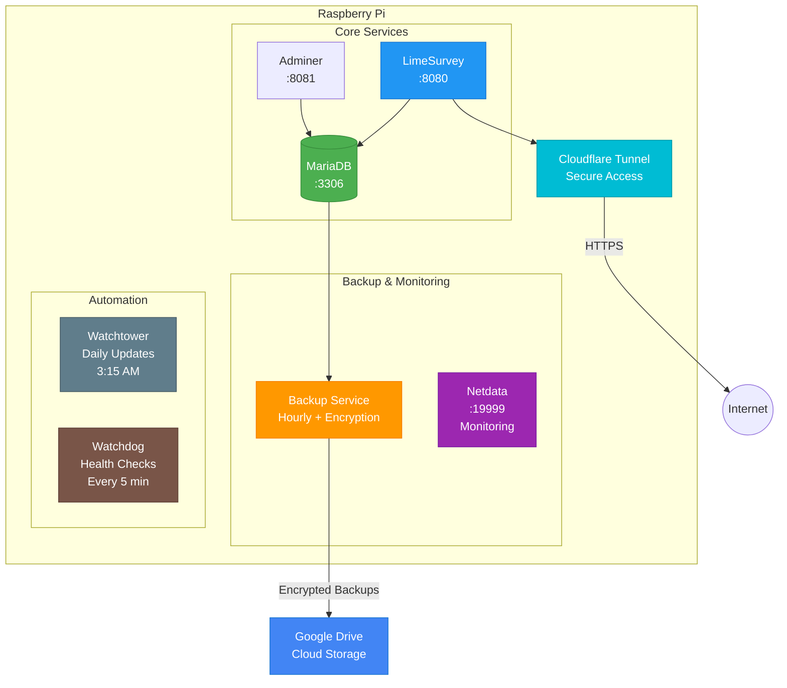

# LimeSurvey on Raspberry Pi with Auto-Backup & Monitoring

[](https://github.com/etiennechabert/limesurvey-pi-stack/actions/workflows/ci.yml)
[](https://github.com/etiennechabert/limesurvey-pi-stack/actions/workflows/security.yml)
[](https://opensource.org/licenses/MIT)
[](https://www.docker.com/)
[](https://www.raspberrypi.org/)

A complete Docker setup for running LimeSurvey on a Raspberry Pi with automatic database backups to Google Drive, secure access via Cloudflare Tunnel, and comprehensive monitoring.

## Features

- LimeSurvey survey platform
- MariaDB database with Adminer web interface
- Automatic hourly database backups to Google Drive
- **Intelligent backup rotation** (grandfather-father-son) saves 99% storage
- **Backup encryption** with AES-256 (protects user passwords)
- **Restore on boot** - optional stateless mode validates backups work every reboot
- Automatic database restoration from Google Drive on startup
- Cloudflare Tunnel for secure access without port forwarding
- Netdata monitoring (host metrics, container metrics, HTTP monitoring)
- **Docker health checks** for all containers
- **Watchtower** for automatic daily updates (3:15 AM)
- **Watchdog** for automatic recovery and Pi reboot on critical failures
- **Image pull on startup** ensures latest versions
- Auto-start on Raspberry Pi boot
- Fully autonomous and self-healing
- **GitHub Actions CI/CD** - Automated testing and security scanning

## 📚 Documentation

### Essential Reading (Start Here)
1. **[QUICKSTART.md](QUICKSTART.md)** - 30-minute setup guide for first-time deployment
2. **[BACKUP_GUIDE.md](BACKUP_GUIDE.md)** - Backup configuration, encryption, and restore operations
3. **[RESTORE_ON_BOOT.md](RESTORE_ON_BOOT.md)** - Stateless Pi mode (validates backups work on every boot)

### Security & Operations
4. **[SECURITY.md](SECURITY.md)** - Security best practices, encryption, compliance (GDPR/HIPAA)
5. **[CONTRIBUTING.md](CONTRIBUTING.md)** - GitHub Actions CI/CD, testing, and contribution guidelines

### For Survey Users
6. **[FOR_SURVEY_USERS.md](FOR_SURVEY_USERS.md)** - Non-technical guide for people taking surveys

### Reference
- **[LICENSE](LICENSE)** - MIT License
- **[.env.example](.env.example)** - Environment variables template

**All documentation is current and tested.**

## Architecture



## Access Ports (Local Network)

- **LimeSurvey**: http://raspberry-pi-ip:8080
- **Adminer** (Database Admin): http://raspberry-pi-ip:8081
- **Netdata** (Monitoring): http://raspberry-pi-ip:19999

## Prerequisites

### Hardware
- Raspberry Pi (3B+, 4, or 5 recommended)
- At least 2GB RAM
- 16GB+ microSD card
- Internet connection (for initial setup)

### Software
- Raspberry Pi OS (64-bit recommended)
- Docker and Docker Compose installed

## Initial Setup

### 1. Install Docker on Raspberry Pi

```bash
# Update system
sudo apt-get update && sudo apt-get upgrade -y

# Install Docker
curl -fsSL https://get.docker.com -o get-docker.sh
sudo sh get-docker.sh

# Add pi user to docker group
sudo usermod -aG docker $USER

# Install Docker Compose
sudo apt-get install docker-compose-plugin -y

# Reboot
sudo reboot
```

### 2. Clone or Copy This Repository

```bash
cd ~
git clone <your-repo-url> limesurvey-pi-stack
# OR copy the files manually to ~/limesurvey-pi-stack
cd limesurvey-pi-stack
```

### 3. Configure Google Drive API

#### Create a Service Account

1. Go to [Google Cloud Console](https://console.cloud.google.com/)
2. Create a new project (or select existing)
3. Enable the **Google Drive API**:
   - Go to "APIs & Services" > "Library"
   - Search for "Google Drive API"
   - Click "Enable"

4. Create a Service Account:
   - Go to "APIs & Services" > "Credentials"
   - Click "Create Credentials" > "Service Account"
   - Fill in name and description
   - Click "Create and Continue"
   - Skip optional steps
   - Click "Done"

5. Create and Download Key:
   - Click on the service account you just created
   - Go to "Keys" tab
   - Click "Add Key" > "Create new key"
   - Choose "JSON"
   - Download the file

6. Rename and place the key:
   ```bash
   mv ~/Downloads/your-project-*.json ~/limesurvey-pi-stack/google-credentials.json
   chmod 600 ~/limesurvey-pi-stack/google-credentials.json
   ```

#### Create Google Drive Backup Folder

1. Create a folder in Google Drive for backups (e.g., "LimeSurvey Backups")
2. Right-click the folder > "Share"
3. Share it with the service account email (found in the JSON file, looks like `xxx@xxx.iam.gserviceaccount.com`)
4. Give it "Editor" permissions
5. Get the Folder ID:
   - Open the folder in Google Drive
   - Copy the ID from the URL: `https://drive.google.com/drive/folders/FOLDER_ID_HERE`

### 4. Configure Cloudflare Tunnel

#### Set up Cloudflare Tunnel

1. Go to [Cloudflare Zero Trust Dashboard](https://one.dash.cloudflare.com/)
2. Create an account if you don't have one (free tier works)
3. Add your domain to Cloudflare (if not already)
4. Go to "Access" > "Tunnels"
5. Click "Create a tunnel"
6. Choose "Cloudflared"
7. Give it a name (e.g., "limesurvey-rpi")
8. Save the tunnel
9. Copy the tunnel token (starts with `eyJ...`)
10. In the "Public Hostname" section:
    - Subdomain: `survey` (or your choice)
    - Domain: Select your domain
    - Service: `http://limesurvey:8080`
11. Save the tunnel

### 5. Configure Environment Variables

```bash
# Copy example environment file
cp .env.example .env

# Edit with your values
nano .env
```

Fill in all the required values:

```env
# Database Configuration
MYSQL_ROOT_PASSWORD=your_very_secure_root_password_here
MYSQL_DATABASE=limesurvey
MYSQL_USER=limesurvey
MYSQL_PASSWORD=your_secure_db_password_here

# LimeSurvey Admin Configuration
LIMESURVEY_ADMIN_USER=admin
LIMESURVEY_ADMIN_NAME=Administrator
LIMESURVEY_ADMIN_EMAIL=your-email@example.com
LIMESURVEY_ADMIN_PASSWORD=your_admin_password_here
PUBLIC_URL=https://survey.yourdomain.com

# Google Drive Configuration
GOOGLE_DRIVE_FOLDER_ID=your_folder_id_from_step_3

# Cloudflare Tunnel Configuration
CLOUDFLARE_TUNNEL_TOKEN=your_tunnel_token_from_step_4
```

### 6. Start the Services

```bash
# Make scripts executable
chmod +x scripts/restore-db.sh
chmod +x scripts/restore-on-boot.sh
chmod +x backup-service/entrypoint.sh

# Start all services
docker compose up -d

# Check logs
docker compose logs -f
```

### 7. Enable Auto-Start on Boot

```bash
# Copy systemd service file
sudo cp limesurvey.service /etc/systemd/system/

# Edit the service file to match your path
sudo nano /etc/systemd/system/limesurvey.service
# Change WorkingDirectory to your actual path (default is /home/pi/limesurvey-pi-stack)

# Reload systemd
sudo systemctl daemon-reload

# Enable the service
sudo systemctl enable limesurvey.service

# Test the service
sudo systemctl start limesurvey.service
sudo systemctl status limesurvey.service
```

## Accessing Services

### LimeSurvey
After setup, access LimeSurvey at:
- **Public URL**: `https://survey.yourdomain.com` (via Cloudflare Tunnel)
- **Local Network**: `http://<raspberry-pi-ip>:8080`

Default admin credentials are from your `.env` file:
- Username: Value of `LIMESURVEY_ADMIN_USER`
- Password: Value of `LIMESURVEY_ADMIN_PASSWORD`

### Adminer (Database Management)
Access the database admin interface at:
- **Local Network**: `http://<raspberry-pi-ip>:8081`

Login credentials:
- System: `MySQL`
- Server: `database`
- Username: Value of `MYSQL_USER` (or `root`)
- Password: Value of `MYSQL_PASSWORD` (or `MYSQL_ROOT_PASSWORD`)
- Database: Value of `MYSQL_DATABASE`

### Netdata (Monitoring Dashboard)
Access comprehensive monitoring at:
- **Local Network**: `http://<raspberry-pi-ip>:19999`

No login required for local access. Netdata shows:
- **System Metrics**: CPU, RAM, disk, network I/O for Raspberry Pi
- **Container Metrics**: Resource usage for each Docker container
- **HTTP Monitoring**: LimeSurvey response time and success rate
- **Alerts**: Automatic alerts for high resource usage or service failures
- **Real-time Graphs**: Live updating charts (updates every second)

#### What Netdata Monitors

**Host (Raspberry Pi):**
- CPU usage per core
- RAM and swap usage
- Disk I/O and space
- Network traffic
- Temperature (if available)
- System load

**Docker Containers:**
- Per-container CPU usage
- Per-container memory usage
- Per-container network traffic
- Per-container disk I/O
- Container status

**LimeSurvey Application:**
- HTTP endpoint availability
- Response time (latency)
- HTTP status codes
- Request success/failure rate

**Note**: Netdata cannot monitor Cloudflare tunnel traffic metrics (requests from the internet). For that, check your Cloudflare Zero Trust dashboard at https://one.dash.cloudflare.com

## Health Checks & Automated Updates

### Docker Health Checks

All containers include health checks that verify proper operation:
- Containers are automatically restarted if unhealthy
- Health status visible in `docker compose ps`
- Netdata shows health check results in real-time

### Watchtower - Automatic Updates

Watchtower automatically updates containers daily at 3:15 AM:
- Pulls latest Docker images from Docker Hub
- Updates one container at a time (rolling updates)
- Verifies health checks pass after update
- Cleans up old images
- Scheduled at 3:15 AM to avoid conflict with 3:00 AM backup

**Benefits:**
- ✅ Always running latest security patches
- ✅ Automatic bug fixes
- ✅ No manual intervention required
- ✅ Minimal downtime (~30 seconds per container)

**IMPORTANT - Data Persistence:**
- ⚠️ **Container updates do NOT restore from backup**
- ⚠️ **Your data persists in Docker volumes**
- ⚠️ **Updates replace the program, not your data**
- ✅ Survey data, responses, and uploads are safe during updates

**When restore happens:**
- ✅ First installation (empty database)
- ✅ Manual volume deletion
- ❌ NOT during updates/restarts

**See detailed explanation:** [BACKUP_AND_PERSISTENCE.md](BACKUP_AND_PERSISTENCE.md)

**Disable automatic updates (optional):**
```bash
docker compose stop watchtower
```

### Watchdog - Automatic Recovery

The health monitor watchdog runs every 5 minutes:
- Detects unhealthy/stopped containers
- Attempts automatic restart
- Performs full system restart if needed
- Reboots Pi as last resort (after 5 failures)

**Setup watchdog (recommended):**
```bash
chmod +x scripts/watchdog/health-monitor.sh
sudo cp limesurvey-watchdog.service /etc/systemd/system/
sudo cp limesurvey-watchdog.timer /etc/systemd/system/
sudo systemctl daemon-reload
sudo systemctl enable limesurvey-watchdog.timer
sudo systemctl start limesurvey-watchdog.timer
```

**Monitor watchdog:**
```bash
# Check timer status
sudo systemctl status limesurvey-watchdog.timer

# View logs
sudo tail -f /var/log/limesurvey-watchdog.log
```

### Image Pull on Startup

The systemd service automatically pulls latest images on Pi boot:
- Ensures you're running current versions
- Falls back to cached images if network unavailable
- Rebuilds backup service automatically

## GitHub Actions CI/CD

Comprehensive automated testing runs on every commit:
- ✅ Docker Compose validation
- ✅ Shell script linting (shellcheck)
- ✅ Python code validation
- ✅ Security scanning (no secrets committed)
- ✅ Documentation checks
- ✅ Integration testing
- ✅ Daily security scans (TruffleHog, Trivy, Hadolint)
- 📦 Weekly Dependabot dependency updates

**See:** [CONTRIBUTING.md](CONTRIBUTING.md) for details

## Backup and Restore

> **⚠️ IMPORTANT:** Container updates do NOT trigger restore from backup!
> Your data persists in Docker volumes across updates/restarts.
> Restore only happens on first install, after volume deletion, or with RESTORE_ON_BOOT=true.

### Automatic Backups

Backups run automatically every hour by default (on the hour: 1:00, 2:00, 3:00, etc.):
- Database is dumped and compressed
- Uploaded to Google Drive
- **Intelligent backup rotation** automatically manages Google Drive storage
- Last 5 local backups are kept on Pi
- No downtime during backup

**Backup Configuration:**
- **Frequency**: Hourly by default (configurable via `BACKUP_SCHEDULE` in `.env`)
- **Rotation**: Intelligent policy keeps ~47 backups (hourly/daily/weekly/monthly/yearly)
- **Encryption**: Optional AES-256 (recommended - 5 min setup)
- **Storage**: Google Drive + last 5 local copies

**See:** [BACKUP_GUIDE.md](BACKUP_GUIDE.md) for encryption setup, restore procedures, and configuration options

**Restore on Boot (Stateless Mode):**
- Enable: Set `RESTORE_ON_BOOT=true` in `.env`
- Validates backups work on every reboot
- Makes Pi disposable - Google Drive is source of truth
- **See:** [RESTORE_ON_BOOT.md](RESTORE_ON_BOOT.md)

### Manual Backup

```bash
docker compose exec db_backup python /app/backup.py
```

### Check Backup Logs

```bash
docker compose logs -f db_backup
```

### Manual Restore

To manually restore from a backup:

1. Stop the containers:
   ```bash
   docker compose down
   ```

2. Remove the restore marker:
   ```bash
   docker volume rm limesurvey-pi-stack_db_data
   ```

3. Start containers (will auto-restore latest backup):
   ```bash
   docker compose up -d
   ```

## Maintenance

### View Logs

```bash
# All services
docker compose logs -f

# Specific service
docker compose logs -f limesurvey
docker compose logs -f database
docker compose logs -f db_backup
docker compose logs -f cloudflared
docker compose logs -f adminer
docker compose logs -f netdata
```

### Update Containers

```bash
docker compose pull
docker compose up -d
```

### Stop Services

```bash
docker compose down
```

### Restart Services

```bash
docker compose restart
```

## Troubleshooting

### LimeSurvey not accessible

1. Check if containers are running:
   ```bash
   docker compose ps
   ```

2. Check LimeSurvey logs:
   ```bash
   docker compose logs limesurvey
   ```

3. Verify Cloudflare Tunnel status in the Cloudflare dashboard

### Backup failing

1. Check backup service logs:
   ```bash
   docker compose logs db_backup
   ```

2. Verify Google credentials file exists:
   ```bash
   ls -la google-credentials.json
   ```

3. Verify service account has access to Google Drive folder

4. Test manual backup:
   ```bash
   docker compose exec db_backup python /app/backup.py
   ```

### Restore not working

1. Check if credentials are mounted:
   ```bash
   docker compose exec database ls -la /backups/google-credentials.json
   ```

2. Check database logs:
   ```bash
   docker compose logs database
   ```

3. Verify backups exist in Google Drive

### Auto-start not working

1. Check service status:
   ```bash
   sudo systemctl status limesurvey.service
   ```

2. Check service logs:
   ```bash
   sudo journalctl -u limesurvey.service -f
   ```

3. Verify service is enabled:
   ```bash
   sudo systemctl is-enabled limesurvey.service
   ```

### Netdata not showing data

1. Check if Netdata container is running:
   ```bash
   docker compose ps netdata
   ```

2. Check Netdata logs:
   ```bash
   docker compose logs netdata
   ```

3. Verify Docker socket is accessible:
   ```bash
   docker compose exec netdata ls -la /var/run/docker.sock
   ```

4. Restart Netdata:
   ```bash
   docker compose restart netdata
   ```

### Adminer cannot connect to database

1. Verify database container is running:
   ```bash
   docker compose ps database
   ```

2. Use these connection details in Adminer:
   - System: `MySQL`
   - Server: `database` (not localhost)
   - Username: `limesurvey` or `root`
   - Password: From your `.env` file
   - Database: `limesurvey` (or leave empty)

## Security

- ✅ Change all passwords in `.env` file
- ✅ Enable backup encryption (AES-256)
- ✅ Store encryption key in 1Password
- ✅ Never commit `.env` or `google-credentials.json`
- ✅ Set up Cloudflare Access policies
- ✅ Monitor backup logs and security scans

**See:** [SECURITY.md](SECURITY.md) for comprehensive security guide, encryption setup, and compliance (GDPR/HIPAA)

## Resource Usage

Typical resource usage on Raspberry Pi 5 (8GB):
- **CPU**: 5-15% idle, up to 40% during active surveys
- **RAM**: ~2.0-2.4GB total
  - LimeSurvey: ~200-300MB
  - MariaDB: ~400-600MB
  - Backup Service: ~100MB
  - Netdata: ~150-200MB
  - Adminer: ~50MB
  - Cloudflare Tunnel: ~50MB
  - Watchtower: ~20MB (only active during updates)
- **Disk**: ~3-4GB for containers, varies with survey data and backups
- **Network**: Minimal when idle, varies with survey traffic

Note: These are approximate values. Actual usage depends on survey complexity, number of responses, and active users.

## File Structure

```
limesurvey-pi-stack/
├── docker-compose.yml              # Main Docker Compose configuration
├── .env                            # Environment variables (create from .env.example)
├── .env.example                    # Example environment file
├── google-credentials.json         # Google Service Account key (you provide)
├── .gitignore                     # Git ignore file
├── LICENSE                        # MIT License
│
├── README.md                      # Main documentation (you are here)
├── QUICKSTART.md                  # 30-minute setup guide
├── BACKUP_GUIDE.md                # Backup configuration & encryption
├── RESTORE_ON_BOOT.md             # Stateless Pi mode
├── SECURITY.md                    # Security best practices
├── CONTRIBUTING.md                # CI/CD & contributing
│
├── limesurvey.service             # Systemd service for auto-start
├── limesurvey-watchdog.service    # Watchdog systemd service
├── limesurvey-watchdog.timer      # Watchdog systemd timer (5 min)
│
├── .github/                       # GitHub Actions workflows
│   ├── workflows/
│   │   ├── ci.yml                 # Main CI pipeline
│   │   └── security.yml           # Security scanning
│   └── dependabot.yml             # Automated dependency updates
│
├── backup-service/                # Backup service Docker image
│   ├── Dockerfile
│   ├── backup.py                  # Backup script with encryption
│   ├── entrypoint.sh             # Container entrypoint
│   └── requirements.txt          # Python dependencies
│
├── scripts/                       # Utility scripts
│   ├── restore-db.sh             # Database restore script
│   ├── restore-on-boot.sh        # Volume cleanup for stateless mode
│   ├── pre-commit-check.sh       # Security check before commits
│   └── watchdog/
│       └── health-monitor.sh     # Health monitoring & recovery
│
├── monitoring/                    # Monitoring configuration
│   └── netdata/
│       ├── health.d/             # Custom health alerts
│       │   └── limesurvey.conf
│       └── go.d/                 # Custom collectors
│           └── httpcheck.conf    # HTTP monitoring config
│
└── backups/                       # Local backup storage (auto-created)
```

## Quick Reference

### Service URLs (Replace `<pi-ip>` with your Raspberry Pi IP address)

| Service | URL | Purpose |
|---------|-----|---------|
| LimeSurvey | `http://<pi-ip>:8080` | Survey platform |
| Adminer | `http://<pi-ip>:8081` | Database admin |
| Netdata | `http://<pi-ip>:19999` | Monitoring dashboard |
| Public Access | `https://your-domain.com` | Via Cloudflare Tunnel |

### Common Commands

```bash
# Start all services
docker compose up -d

# Stop all services
docker compose down

# View logs
docker compose logs -f

# Restart specific service
docker compose restart limesurvey

# Check running containers
docker compose ps

# Update all containers
docker compose pull && docker compose up -d

# Manual backup
docker compose exec db_backup python /app/backup.py

# Enable auto-start
sudo systemctl enable limesurvey.service

# Check service status
sudo systemctl status limesurvey.service
```

### Container Resource Limits

If you want to limit container resources (optional), add to `docker-compose.yml`:

```yaml
deploy:
  resources:
    limits:
      cpus: '1.0'
      memory: 512M
```

## License

This project is licensed under the **MIT License** - see the [LICENSE](LICENSE) file for details.

### What This Means

- ✅ Free to use, modify, and distribute
- ✅ Can be used commercially
- ✅ Just keep the copyright notice
- ✅ No warranty provided

### Third-Party Components

This project uses the following open-source software, each with their own licenses:

- **LimeSurvey**: GPL v2+ - [License](https://www.limesurvey.org/about-limesurvey/license)
- **MariaDB**: GPL v2 - [License](https://mariadb.com/kb/en/mariadb-license/)
- **Adminer**: Apache 2.0 / GPL v2 - [License](https://www.adminer.org/)
- **Netdata**: GPL v3 - [License](https://github.com/netdata/netdata/blob/master/LICENSE)
- **Cloudflare Tunnel**: Cloudflare Terms - [Terms](https://www.cloudflare.com/terms/)
- **Watchtower**: Apache 2.0 - [License](https://github.com/containrrr/watchtower/blob/main/LICENSE)

**Note:** This MIT License applies only to the configuration, scripts, and documentation in this repository, not to the third-party software listed above.

## Support

For issues with:
- **LimeSurvey**: Visit [LimeSurvey Forums](https://forums.limesurvey.org/)
- **Docker setup**: Check Docker and Docker Compose documentation
- **Cloudflare Tunnel**: Visit [Cloudflare Docs](https://developers.cloudflare.com/cloudflare-one/connections/connect-apps/)
- **This setup**: Open an issue in this repository
